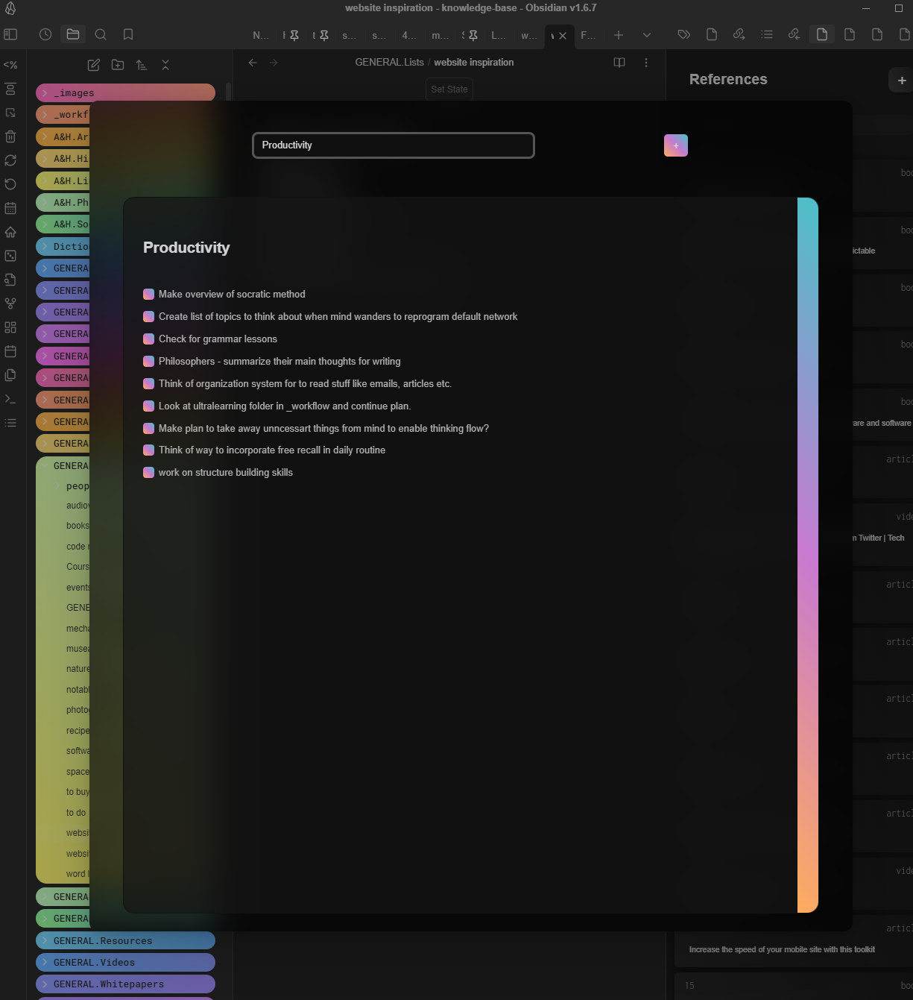

# 4000 Weeks To Do List
A task management system inspired by Oliver Burkeman's 4000 weeks.

This plugin has several components, which all can be turned off and on depending on the user's preferences.

The main components is a task management system based on Oliver Burkeman's 4000 Weeks.
This includes a categorized open to do list, with an interface. The purpose of this is to add any task that comes to mind. The categories can be customized. The interface allows you to add, delete, batch-add, or move tasks to the closed list.
Then there is the closed to do list, which contains the tasks you're focusing on at the current time. You can set a maximum for this list if desired.

---

## Open To Do Lists

The root for the open to do lists will be a folder. Every file inside that that folder (no matter how deep) will be regarded as a category.

---
## TLDR

